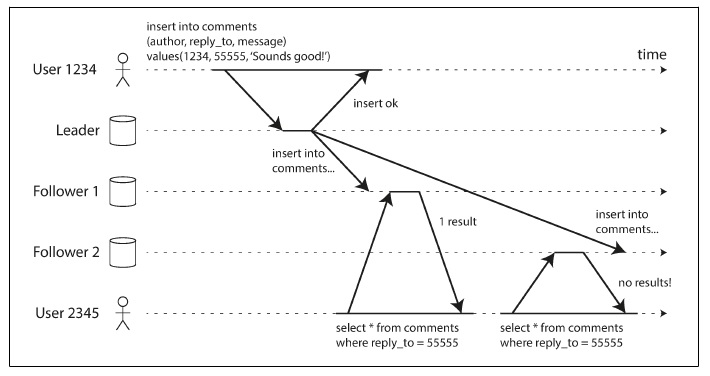

## Monotonic Reads
This is a second example of replication lag. It's possible for a user to see things `moving backward in time` when reading from asynchronous followers. This can happen if a user makes several reads from different replicas.

`Monotonic reads` is a guarantee that this kind of anomaly does not happen.

* less guarantee than strong consistency
* But a stronger guarantee than eventual consistency

One way of achieving monotonic reads is to make sure that each user always makes their reads from the `same replica`. Hoewever, if that replica fails, the user's queries will need to be rerouted to another replica.

## Consistent Prefix Reads
This is a third example of replication lag anomalies concerns violation of causality.

Theres a conversation between two person and one observer. If the first person's sentance has a little lag, observer would hear the second sentance first, then first sentance next.

Preventing this kind of anomaly requires another type of guarantee: `consistent prefix reads`. This guarantee says that if a sequence of writes happens in a certain order, then anyone reading those writes will see them appear in the same order.

This happens when different partitions operate independently, so there is no golbal ordering of writes: when a user reads from the database, they may see some parts of the database in an order state and some in a newer state.

### Solution
* to make sure that any writes that are casually related to each other are written to the same partition
  
  * But in some appications that cannot be done effieicntly.

## Solutions for Replication Lag
It's important to design the system to provide a stronger guarantee, such as read-after-write. Pretending that replication is synchronous when in fact it is asynchronous is a recipe for problems down the line.

In the move to distributed databases, many systems have abandoned them, claiming that transactions are too expensive in terms of performance and availability, and asserting that eventual consistency is inevitable in a scalable system.

There are ways in which an application can provide a stronger guarantee than the underlying database. However, dealing with these issues in application code is complex and easy to get wrong.

`transaction` is a way for a database to provide stronger guarantees so that the application can simpler.