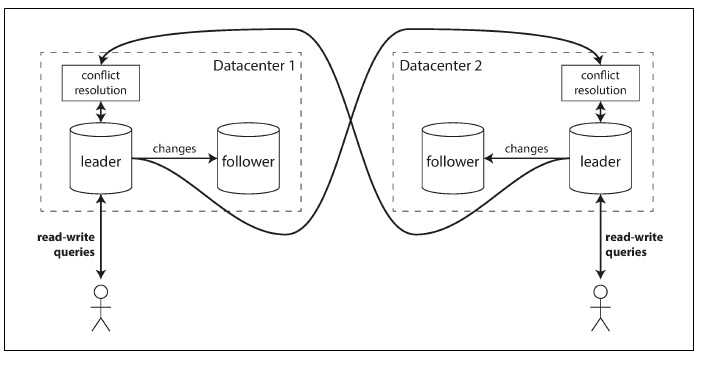

## Multi-Leader Replication

Leader-based replication has one major downside: there is only one leader, and all writes must go through it. If connection failed to the leader, the write cannot be done to database.

A natural extension of the leader-based replication model allow more than one node to accept writes. Replication still happens in the same happens in the same way: each node that processes a write must forward that data change to all the other nodes. This is a `multi-leader` configuration. Each leader simultaneously acts as a follower to the other leader.

### Use Cases for Multi-Leader Replication
Using a multi-leader setup within a single datacenter rarely makes sence, because the benefits rarely outweigh the added complexity. However, there are some situations in which this configuration is reasonable.

#### Multi-datacenter operation
In a multi-leader configuration, you can have a leader in `each` datacenter.

Compare how the single-leader and multi-leader configurations fare in a multi-datacenter development

* Performance
  
  In a single-leader configuration
  ```
  Every writes must go over the internet to the datacenter with the leader. This can add significant latency to writes and might contravene the purpose of having multiple datacenters in the first place
  ```

  In a multi-leader configuration
  ```
  Every write can be processed in the local datacenter and is replicated asynchronously to the other datacenters. Thus, the inter-datacenter network delay is hidden from users, which means the perceived performance may be better
  ```
* Tolerance of datacenter outages
  In a single-leader configuration
  ```
   If the datacenter with the leader fails, failover can promote a follower in another datacenter to be leader.
  ```  
  In a multi-leader configuration
  ```
  Each datacenter can continue operating independently of the others, and replication catches up when the failed datacenter comes back online
  ```

* Tolerance of network problems
  
  Traffic between datacenters usually goes over the public internet, which may be less reliable than the local network within a datacenter.

  In a single-leader configuration
  ```
  It is very sensitive to problems in this inter-datacenter link, because writes are made synchronously over this link
  ``` 

  In a multi-leader configuration
  ```
  It's asynchronous replication can usually tolerate network problems better: a temporary network interruption does not prevent writes being processed.
  ```
 
 ##### multi-leader configuration external tools
 * MySQL: Tungsten Replication
 * PostgreSQL: BDR
 * Oracle: GoldenGate

 #### Downside of multi-leader replication
 * The same data may be concurrently modified in two different datacenters, and those write conflicts must be resolved.

 * Multi-leader replication is often considered dangerous territory that should be avoided if possible
  
  ```
  Multi-leader replication is a somewhat retrofitted feature in many databases, there are often subtle configuration pitfalls and surprising interactions with other database features.  
  ```

  