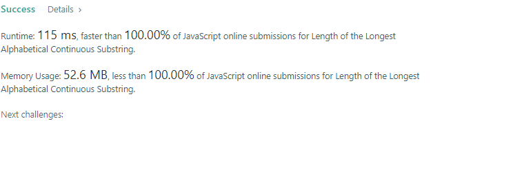

# September 17. 2022

## Leetcode contest

### Schedule
* 7:30 to 9. 1.5 hr
* attended at 8:20
* solved 2 problems

No.6180 was not difficult. solved in 15 mins
Took over an hour for the question 6181.
Finally solved using object with starting point and ending point.

Happy to see the result  
