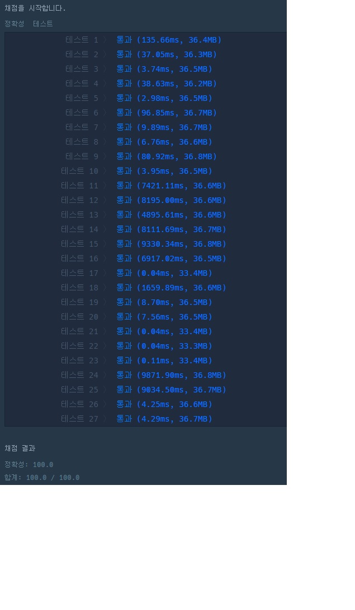

# Count Weight of all soldiers


```js
function solution(number, limit, power) {
    var answer = 0;
    let id = 1;
    
    
    while (id <= number) {
        let divisor = 0;
        for (let i = 1; i <= id / 2 && divisor <= limit; i ++) {
            if (id % i === 0) divisor ++;
        }
        divisor ++;
        if (divisor > limit) {
            answer += power;
        } else {
            answer += divisor;
        }
        id ++;
    }
    
    return answer;
}
```


