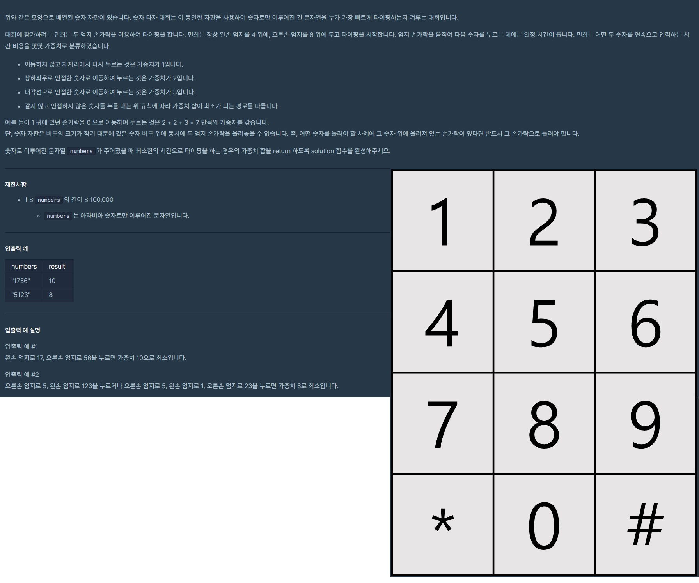

# numberTyping



## NOT SOLVED YET
```js
const position = {
        1: [1,1],
        2: [1,2],
        3: [1,3],
        4: [2,1],
        5: [2,2],
        6: [2,3],
        7: [3,1],
        8: [3,2],
        9: [3,3],
        0: [4,2],
}


function calcDistance(fingerPosition, currentNumberPosition) {
    let distance = 0;
    let horizontalDistance = fingerPosition[0] - currentNumberPosition[0];
    let verticalDistance = fingerPosition[1] - currentNumberPosition[1];
    if (horizontalDistance < 0) horizontalDistance *= -1;
    if (verticalDistance < 0) verticalDistance *= -1;
    distance += (horizontalDistance + verticalDistance + 1);
    console.log("DISTANCE", distance)
    return distance;
}

function findClosestDistance (leftFingerPosition, rightFingerPosition, currentNumberPosition) {
    const leftFingerDistance = calcDistance(leftFingerPosition, currentNumberPosition);
    const rightFingerDistance = calcDistance(rightFingerPosition, currentNumberPosition);
    let closestDistance = {
        isLeft: false,
        distance: 0
    };
    if (leftFingerDistance > rightFingerDistance) {
        closestDistance.distance = rightFingerDistance;
    } else {
        closestDistancedistance = leftFingerDistance;
        closestDistance.isLeft = true;
    }
    return closestDistance;
}

// numbers = String
function solution(numbers) {
    var answer = 0;
    let leftFingerPosition = position["4"];
    let rightFingerPosition = position["6"];
    for (let i = 0; i < numbers.length - 1; i ++) {
        if (numbers[i + 1]) {
            const currentNumber = numbers[i];
            const currentNumberPosition = position[currentNumber]
    console.log(leftFingerPosition, rightFingerPosition, currentNumberPosition)
        const {distance, isLeft} = findClosestDistance(leftFingerPosition, rightFingerPosition, currentNumberPosition)
            answer += distance;
            isLeft ? leftFingerPosition = position[currentNumber] : rightFingerPosition = position[currentNumber]
        }
    }
    
    return answer;
}
```