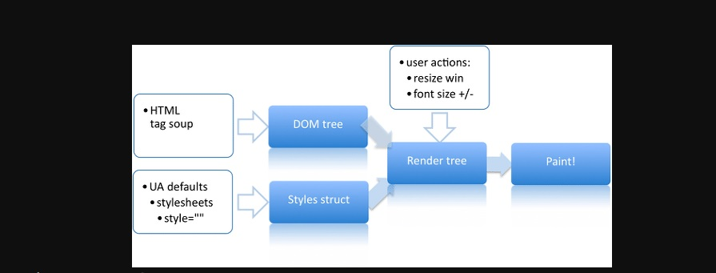

# JavaScript rendering in browser
Browser Rendering is a key factor to improve UX. To provide better UX, `minimize` javascript implementation

## Rendering Process
`Rendering` is a process transforming documentational expression to graphical expression.
* Create(calculate) Layout based on DOM element and Style
* Express calculated layout on screen

1. Create DOM Tree
2. Style structuring<br />
- Style information is processed step by step, and the last stage of style information takes precedence over the previous style.<br />
  2-1. Default style information provided by browser<br /> 
  2-2. Defined by user (css file)<br />
  2-3. Inline style information directly set in html tag<br />

3. Generate Render Tree
Unlike the DOM tree, the render tree consists of nodes that have style information set on each node and are represented on the screen. In the render tree, each node is called a `frame` or `box` and has CSS box property information.

4. Layouts
This process controlled by `CSS Visual Rendering Model` and start from :root to children

5. Paint
The rendering engine knows where the element should be represented, so it will tour the rendering tree and call the paint function to represent the node on the screen.

## Reflow && Refaint
With all subsequent renderings complete, changes occur in some areas of the screen depending on the user's interaction or the functionality of the page
```js
  // ESAMPLE
  // Transition layer || fetch data to add new elements on page
```

* Reflow
Recalculate of nodes and position(node's location) with validation of render tree. This is called `Reflow` OR `Layout` OR `Layouting`. More precisely, the size or location of the nodes changes, affecting the current layout, resulting in reflows when the placement needs to be redeployed.
* Refaint
1. Reflow
2. Updated simple style(background-color..)
In either case, reflow and refaint can slow down the UI's screen representaion, which can affect the user experience, so it should be minimized when writing code.

* What cause `Reflow` and `Refaint`
1. Update DOM Node: add, remove
2. Update Element
```js
  // display:none => reflow & refaint
  // visibility: hidden => refaint
```
3. Script animation: Animation cause multiple times of update of Node & style
4. Style : adding new style sheet OR Update previous style
5. User action : change browser size, font size ...

## Minimizing Reflow
* Grouping
* Display : After all style updated, change display 
* Copy Node : Copied node is not added on DOM. not cause reflow or refaint
* Use createDocumentFragment()
* Cacheing : store with variable
* CSS style : 
  1. Rather than accessing each element to change its value, recommended to create a CSS rule and that rule be reflected in the element.
  2. If don't have a large number of target elements, try approaching and processing individual elements faster than CSS rule processing. 