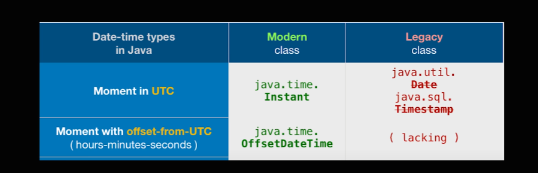

# Date
`Moment.js` library not only parses dates from strings, but it may also be used to validate, manipulate, and format dates. It supports internationalization, which is important with dates, as well as human-friendly formatting
https://golb.hplar.ch/2017/01/JavaScript-Date-and-moment-js.html

## Date


```js
  const date = new Date(); // = System.out.printIn(date) in Java
  console.log(date) // new Date() => RFC type
  console.log(date.toISOString()) // => ISO type
  
  // To get Year / Month / Date .. need to manually type
  date.getFullYear() // year
  date.getMonth() // month => 0~11
  date.getDate() // date

  /******************* CONS *********************/
  // setDate
  date.setDate(date.getDate() + 7) // after 7 days from today

  const newDate = new Date(2022, 9, 31)
  newDate.setMonth(date.getMonth() + 1)
  console.log(newDate) // Thy `Dec` 01 2022 is printed not `Nov` 
  // to handle this.. 1. use if
  function addMonths(date, months) {
    const d = date.getDate();
    date.setMonth(date.getMonth() + months);
    if (date.getDate() !== d) {
      date.setDate(0)
    }
    return date;
  }
  
  // 2. moment.js
  // 3. vanilla js..
    // Intl
  const date = new Date();
  const a = new Intl.DateTimeFormat("en").fomrmat(date);
  console.log(a)
  const b = new Intl.DateTimeFormat("kr", {
    dateStyle: "full",
    timeStyle: "full"
  }).format(date);
  console.log(b)
  // Pros of Intl : time differences
  const date = new Date();
  const a = new Intl.RelativeTimeFormat().format(-10, "months")

  // 3_extra. Temporal => stage3
  // import ....js-temporal...
  let now = Temporal.Now.plainDateTimeISO();
  now = now.subtract({days: 10, months: 3})
  now = now.add({days: 10, months: 3})
```