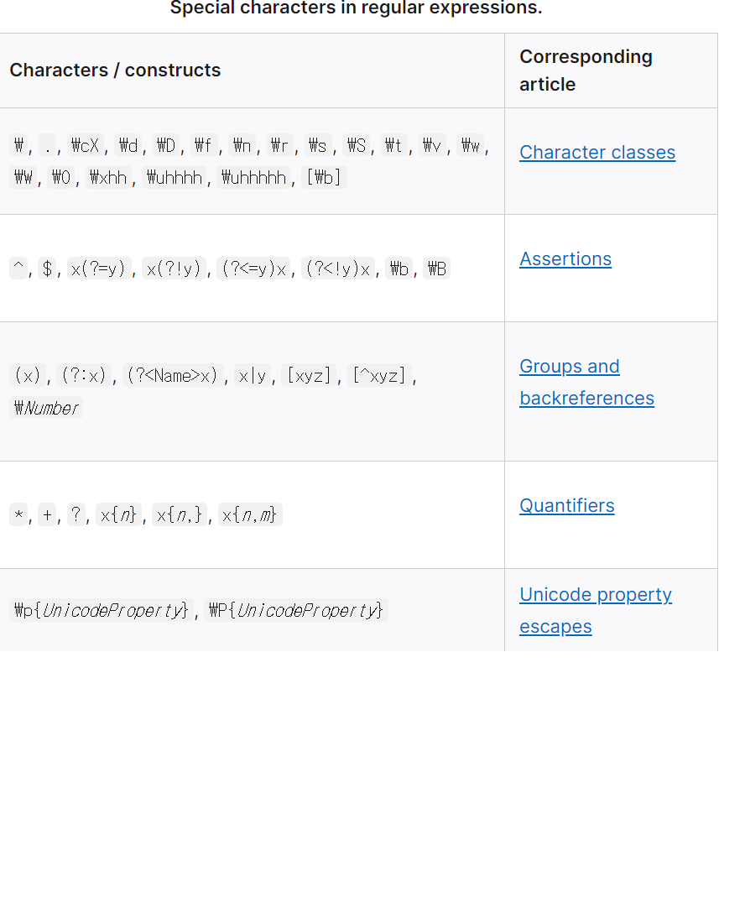
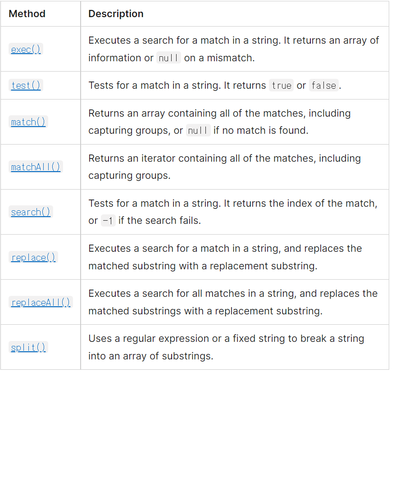

# Regular Expressions
https://developer.mozilla.org/en-US/docs/Web/JavaScript/Guide/Regular_Expressions

https://regexr.com/

Regular expressions are patterns used to match character combinations in strings. In `JavaScript`, regular expressions are also `objects`.
* Patterns with..
```js
// RegExp
exec()
test()

// String
match()
matchAll()
replace()
replaceAll()
search()
split()
```

## Creating a regular expression
1. using a regular espression literal
```js
  const re = /ab+c/;
```
2. calling the constructor function of the `RegExp` object
```js
  const regex = new RegExp("ab+c");
  // Using the constructor function provides runtime compilation of the regular expression. Use the constructor function when you know the regular expression pattern will be changing
  // => dynamic value
  // Or you don't know the pattern and are getting it from another source
```



## Escaping
putting a backslash in front of the special characters 
```js
// regex
`/a\*b/`
// RegExp contructor
new RegExp("a\\*b")
```

## Using parentheses
Regular expressions are used with the `RegExp` methods.


```js
  const myRegex = /d(b+)d/g;
  const myArray = myRegex.exec("cdbbdbsbz");

  // same
  const myArray = /d(b+)d/g.exec("cdbbdbsbz");

  // similar to
  "cbddbsbz".match(/d(b+)d/g) // ["dbbd"];

  // while
  /d(b+)d/g.exec("cdbbdbsbz") // ["dbbd", "bb", index: 1, input: "cdbbdbsbz"]

  // construct
  const myRegex = new RegExp("d(b+)d", "g");
  const myArray = myRegex.exec("cdbbdbsbz");
```

## Advanced searching with flags
Regular expressions have optional flags that allow for functionality like global searching and case-insensitive searching.
```
Flag & Description && Corresponding property
d & Generate indices for substring matches && hasIndices
g & Global seargh && global
i & Case-insensitive search && multiline
m & Allows `^` and `$` to match newline characters && multiline
s & Allows `.` to match newline characters && dotAll
u & `Unicode`; treat a pattern as a sequence of Unicode code points && unicode
y & Perform a "sticky" search that matches starting at the current position in the target string
```

```js
const re = /patttern/flags;

// OR

const re = new RegExp("pattern", "flags")
```

## Gloabl search with exec()
```js
const str = 'fee fi fo fum';
const re = /\w+\s/g;

console.log(re.exec(str)); // ["fee ", index: 0, input: "fee fi fo fum"]
console.log(re.exec(str)); // ["fi ", index: 4, input: "fee fi fo fum"]
console.log(re.exec(str)); // ["fo ", index: 7, input: "fee fi fo fum"]
console.log(re.exec(str)); // null
```

## Using special characters to verify input
```js
const form = document.querySelector('#form');
const input = document.querySelector('#phone');
const output = document.querySelector('#output');

const re = /^(?:\d{3}|\(\d{3}\))([-/.])\d{3}\1\d{4}$/;

function testInfo(phoneInput) {
  const ok = re.exec(phoneInput.value);

  output.textContent = ok
    ? `Thanks, your phone number is ${ok[0]}`
    : `${phoneInput.value} isn't a phone number with area code!`;
}

form.addEventListener('submit', (event) => {
  event.preventDefault();
  testInfo(input);
});
```