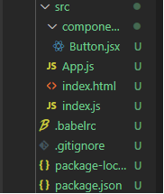
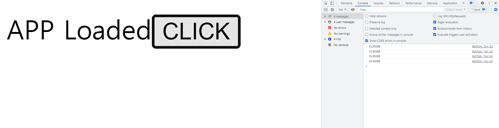

# React Hooks

## Process
* create react app
=> custom create my own react app
* create components
* test hooks

### Create custom react boilerplate
* WHY not CRA(create react app)<br/>
CRA_pros: 
<ol>
  <li>get started with a single command.</li>
  <li>just focus on React alone and don't have to worry about webpack, babel, and other build dependencies. </li>
  <li>easy to maintain and upgrade with just one command_`react-scripts`</li>
</ol>
 CRA_cons:
<ol>
  <li>difficult to add custom build configs. To add custom configs is to eject the app, but then it overrides the Only one build dependency advantage. The other way is to use packages like 'customize-cra' or 'react-app-rewired' but then they have limited capabilities</li>
  <li>https://medium.com/the-node-js-collection/modern-javascript-explained-for-dinosaurs-f695e9747b70</li>
  <li>CRA is bloated. If we are not using the dependencies that CRA supports, it's an extra dependency.</li>
</ol>

#### Steps _ create custom react boilerplate
<ol>
  <li>
    init npm and git AND add gitignore to ignore node_modules, build

    "npm init" and "git init"
    
  </li>
  <li>
    add runtime dependencies<br/>
    "react" and "react-dom"
    
    "npm install react react-dom --save"
  
  </li>
  <li>
    add Transpiler(<a href="#babel">BABEL</a>)<br />
    
    Transpiler converts ECMAScript 2015 + code into a backward-compatible version of JS in current and older browsers. Also we use this to transpile JSX by adding presets.<br />
  
    "npm install @babel/core @babel/preset-env @babel/preset-react --save-dev"
  
  </li>

  <li>
    simple babel config for a React app looks like this. Add this in .babelrc or as a property in package.json And add various presets and plugins based on needs<br />
    <a href="https://babeljs.io/docs/en/presets">babel presets</a> AND
    <a href="https://babeljs.io/docs/en/plugins">babel plugins</a>

    {
      "presets": [
        "@babel/preset-env",
        "@babel/preset-react"
      ]
    }

    // my case, I will use ES6, react, and maybe typescript. But in the default Babel setup, es2015 and react are automattically enabled. No configuration needed

    {
      "presets": [
        "@babel/preset-env",
        "@babel/plugin-transform-typescript",
        "@babel/preset-stage-3"
      ]
    }
  </li>
  <li>add Bundler(Webpack)<br/>
    Bundler bundles our code and all its dependencies together in one or more bundle file(s)

    npm install webpack webpack-cli webpack-dev-server babel-loader css-loader style-loader html-webpack-plugin --save-dev 

  </li>
  <li>webpack.config.js for React application
  <a href="https://webpack.js.org/loaders/">loaders</a>,
  <a href="https://dev.to/nikhilkumaran/webpack-optimizations-production-ready-react-app-1jl3">webpack optimizations</a>

  Create a file called 'webpack.config.js' and add below
  
  ```javascript
    const path = require('path');
  const HtmlWebPackPlugin = require('html-webpack-plugin');

  module.exports = {
    output: {
      path: path.resolve(__dirname, 'build'),
      filename: 'bundle.js',
    },
    resolve: {
      modules: [path.join(__dirname, 'src'), 'node_modules'],
      alias: {
        react: path.join(__dirname, 'node_modules', 'react'),
      },
    },
    module: {
      rules: [
        {
          test: /\.(js|jsx)$/,
          exclude: /node_modules/,
          use: {
            loader: 'babel-loader',
          },
        },
        {
          test: /\.css$/,
          use: [
            {
              loader: 'style-loader',
            },
            {
              loader: 'css-loader',
            },
          ],
        },
      ],
    },
    plugins: [
      new HtmlWebPackPlugin({
        template: './src/index.html',
      }),
    ],
  };
  ```
  </li>
  <li>
    add index.html and react components and both are inside src folder
  </li>
  <li>
    add index.js inside src folder and import App with React from react, ReactDOM from react-dom/client. Then, render components to #root<br />
    `render` from react-dom are not supported from react @18. Use ReactDOM from `react-dom/client`
  </li>
  <li>
    make this app to support jsx file <br />
    add presets to .babelrc in toe root of project.
    add plugins in package.json

```javascript
// .babalrc on root directory
{
  "presets":[
      "@babel/preset-env",
      "@babel/preset-react"
  ]
}

// package.json
  "plugins": [
    "@babel/plugin-syntax-jsx"
  ]
```
  </li>
  <li>
    add start & build scripts in package.json
    
      "scripts": {
        "start": "webpack-dev-server --mode=development --open --hot",
        "build": "webpack --mode=production"
      }
    
  </li>
  <li>
    test to run app

    npm start
  </li>
</ol>


<p id="babel">
  <h3>What is Babel?</h3>

  JavaScript is the language of the web. It runs on many different browsers, like Chrome, Firefox, Edge, and IE... Different browsers have different JavaScript interpreters which execute JavaScript code.
  That's where Babel comes in. Babel is a JavaScript transpiler. Babel enables us to write modern JavaScript that will be "transpiled" to widely-supported ES5 JS which called transpiling.

  <p2>How to use?</p2>
  to use the package 'babel-standalone'

  add this to script tag  
  src="https://cdnjs.cloudflare.com/ajax/libs/babel-standalone/6.18.1/babel.min.js"

  Then, Babel will automatically transpile any script tags with type 'text/babel' OR 'text/jsx'
</p2>

### Steps __ create components and test
